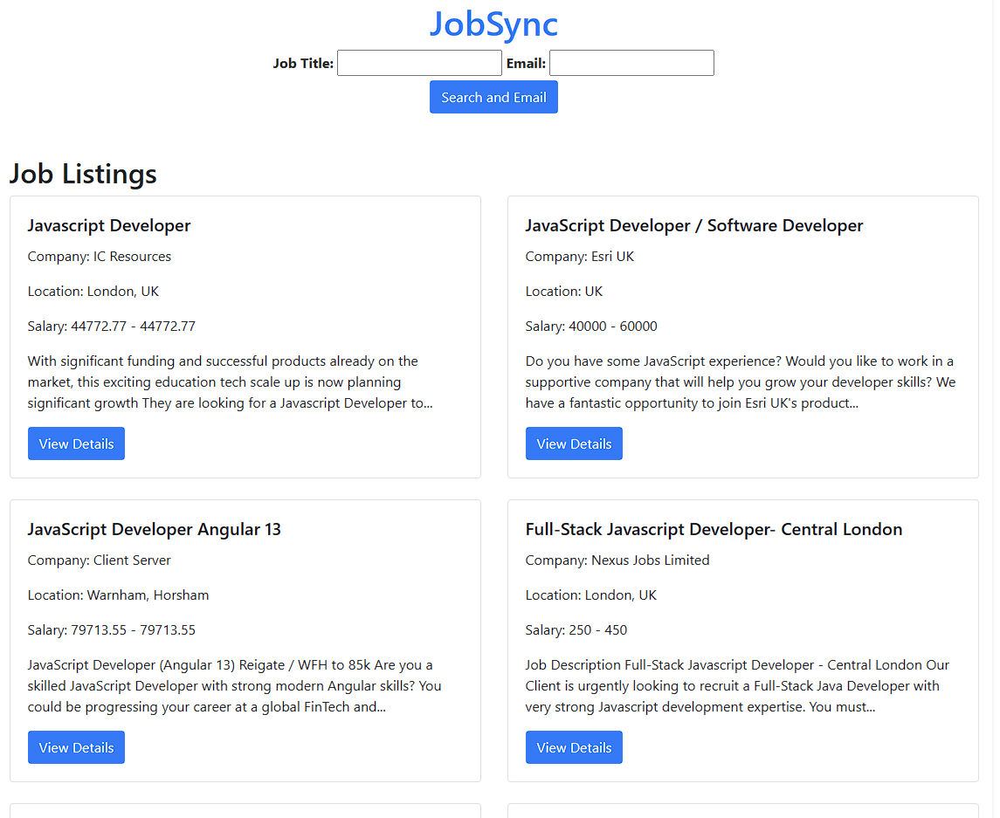

# JobSync

JobSync is a web application that allows users to search for job listings based on job titles and receive real-time job postings. It's built using Flask, a Python web framework, and integrates with the Adzuna Jobs API to fetch and display job listings.

## Features

- Search for job listings by providing a job title.
- Display real-time job postings fetched from the Adzuna Jobs API.
- User-friendly interface with a modern and responsive design.
- Spinner animation while fetching job listings to provide visual feedback.
- Integration with Bootstrap for a clean and attractive UI.

## Tech Stack

- Python
- Flask (Web framework)
- Adzuna Jobs API (For fetching job listings)
- HTML/CSS (Frontend styling)
- Bootstrap (Frontend styling)
- JavaScript (For frontend interactivity)

## How to Run

1. Clone this repository.
2. Install the required dependencies using `pip install -r requirements.txt`.
3. Obtain your Adzuna API credentials (app_id and app_key) and update the `fetch_job_data` function in `app.py`.
4. Run the application using `python app.py`.

## Usage

1. Access the application by navigating to `http://localhost:5000` in your web browser.
2. Enter a job title and click the "Search and Email" button.
3. The application will display a loading spinner while fetching job listings.
4. After a delay of 3 seconds, the job listings will be displayed in a visually appealing format.

## Future Objectives 
1. Implement a more stable backend.
2. Add a login page and database to store all the queries.
3. Add twilio to send the loaded job postings to the user. 

